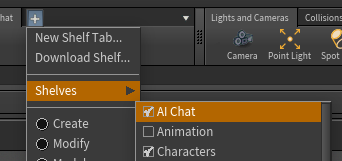
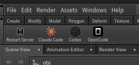

# Yet Another Houdini MCP Server

AI, AI, AI, ... yap, yap, yap ... yawn ... another MCP incoming ... let AI do your Houdini work ....


(This is a fork of [Houdini-claudecode-mcp](https://github.com/atayilgun/Houdini-claudecode-mcp) but I didn't like the name and this version does not target Claude only)

## Self Improvement Philosophy

LLMs are not trained directly on Houdini `*.hip` files, so even simple scene operations can be difficult at first. This MCP project is designed to run the agent from within the repository, where it is encouraged to add reusable tools and document proven workflows in memory notes, so future tasks become faster and more reliable.

## Installation

### 1. Clone the Repository

```bash
git clone https://github.com/lecopivo/another-houdini-mcp
cd another-houdini-mcp
```

### 2. Run Setup Script

```bash
./setup.sh
```

The setup script will:
- Detect your Houdini installation
- Copy `$HFS/houdini/help` into local `help/` (excluding `videos/`, `examples/`, `files/`, `images.zip`) and unpack all `help/*.zip`
- Install Python dependencies
- Install an `AI Chat` shelf tab with a `Restart Server` tool and per-client launcher tools in your Houdini user preferences
- Detect installed MCP-capable AI clients and prompt to install for each one

### 3. Use

Start Houdini, enable `AI Chat` shelf:



Click on one of the available AI clients:




## License

MIT License - See LICENSE file for details

## Acknowledgments

- Based on [Houdini-claudecode-mcp](https://github.com/atayilgun/Houdini-claudecode-mcp)
- Another Houdini MCP [capoomgit/houdini-mcp](https://github.com/capoomgit/houdini-mcp)
- Refined version [kleer001/houdini-mcp](https://github.com/kleer001/houdini-mcp)
